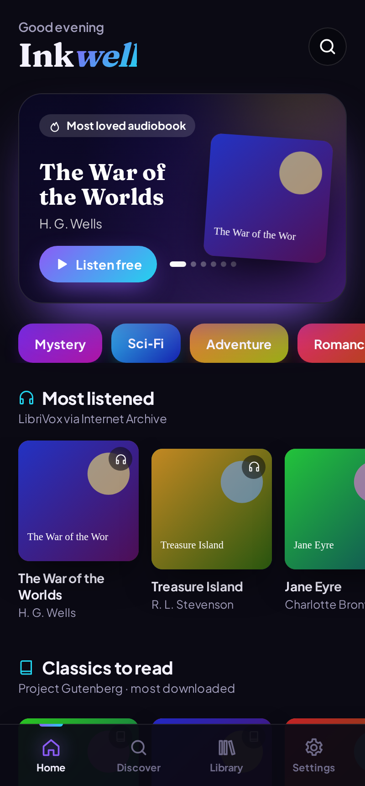
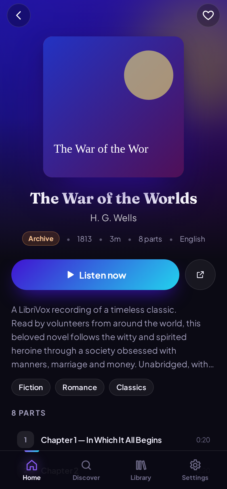
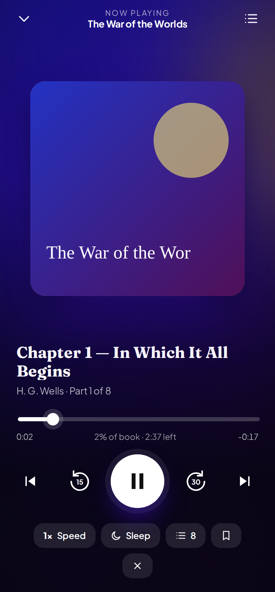
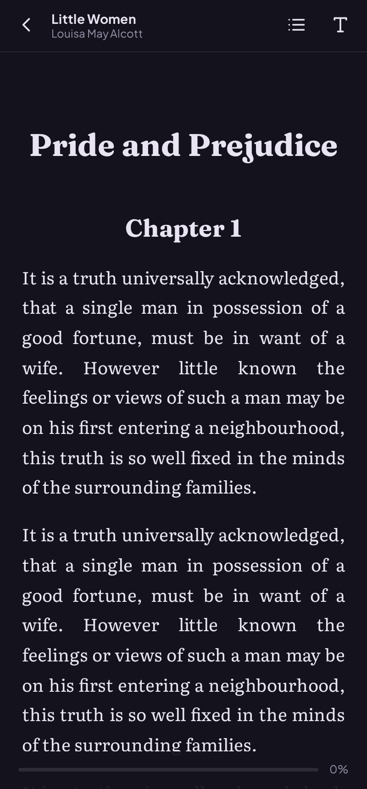

# Inkwell — audiobooks & ebooks for Android

A colourful, fast audiobook player and ebook reader inspired by InkShelf, with
more built-in sources and integrations. Built with Preact and Vite, and packaged
for Android with Capacitor.

<p>
  
  
  
  
</p>

## Highlights

**Look and feel**
- Dark, pure-black (AMOLED) and light modes, with 8 gradient accent themes (Aurora, Sunset, Ocean, Forest, Rose, Ember, Gold, Ice).
- Dynamic colour: the player and book pages take their tint from the cover art.
- Animated ambient background, a rotating hero carousel, glass tab bar, skeleton loaders and bundled variable fonts (Plus Jakarta Sans, Fraunces, Literata).

**Sources (free, built in)**
| Source | What you get |
| --- | --- |
| Internet Archive | The full LibriVox mirror, old-time radio, and spoken-word recordings, with per-chapter tracks |
| LibriVox API | 20,000+ volunteer-read public-domain audiobooks |
| Project Gutenberg (Gutendex) | 75,000+ ebooks you can read in the app |
| Open Library | Trending lists, subjects, descriptions and covers, cross-matched to free audio and ebook editions |

**Integrations**
- **Audiobookshelf**: sign in to your own server to browse, search and stream your library. Listening progress syncs both ways.
- **Addons**: install any catalog addon that uses the Stremio addon protocol (`manifest.json` with `/catalog`, `/meta` and `/stream`). Its catalogs appear on Home and in search.

**Player**
- Background playback with lock-screen and notification controls (runs as a media foreground service).
- Chapters, speeds from 0.5× to 3×, adjustable skip intervals, bookmarks, and a sleep timer that fades out (or stops at the end of a part).
- Progress saved automatically, with a short rewind when you resume after a break.

**Reader**
- Night, Black, Sepia and Paper themes; serif or sans text; adjustable size; table of contents; tap the edges to turn pages; remembers your position.

**Library**
- Saved books, in-progress, finished, listening stats, and backup/restore (export and import as JSON).

## Getting the APK

Every push that touches `inkwell/` runs **.github/workflows/inkwell-apk.yml**. It builds
a signed release APK, attaches it to a GitHub Release called `inkwell-v1.0.<run>`, and
uploads it as a workflow artifact.

To sign with your own permanent key, so that updates install over older versions, add
these repository secrets: `INKWELL_KEYSTORE_BASE64` (`base64 -w0 my.jks`),
`INKWELL_KEYSTORE_PASSWORD`, `INKWELL_KEY_ALIAS`, `INKWELL_KEY_PASSWORD`. Without
them, each build is signed with a throwaway key. Uninstall the old version before
installing a build signed with a different key.

## Develop locally

```bash
cd inkwell
npm install
npm run dev            # web preview at http://localhost:5173
npm run android:apk    # needs the Android SDK (API 36) and JDK 21
npm run icons          # re-render launcher icons & splash from public/icon.svg
```

In a desktop browser, a few sources may be blocked by CORS. The Android app uses
native HTTP, so it doesn't have that limitation.

## Project layout

```
inkwell/
├── src/
│   ├── sources/        archive, librivox, gutenberg, openlibrary, audiobookshelf, addons
│   ├── lib/            player engine, persistent store, theming, http, navigation
│   ├── components/     covers, rows, mini & full player, icons
│   └── screens/        Home, Discover, Library, Settings, Book, Browse, Reader
├── android/            Capacitor Android project (icons, permissions, signing)
└── scripts/make-icons.mjs
```

Built-in sources only serve public-domain or openly licensed works. You are
responsible for any addons or servers you connect.
